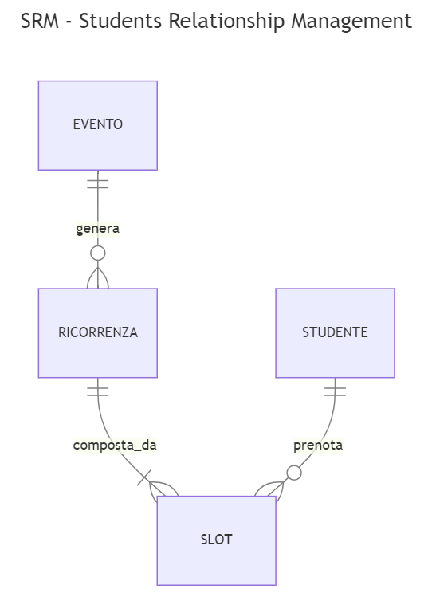
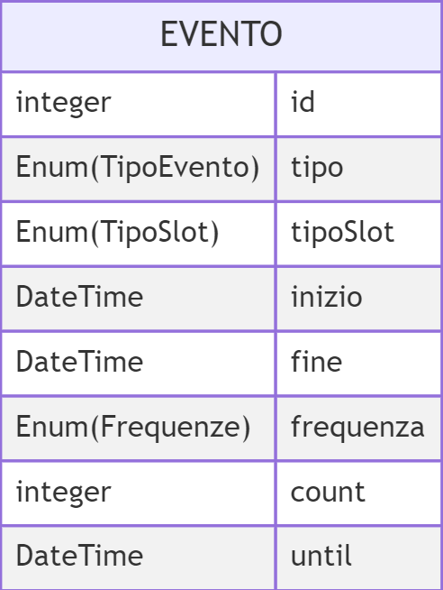
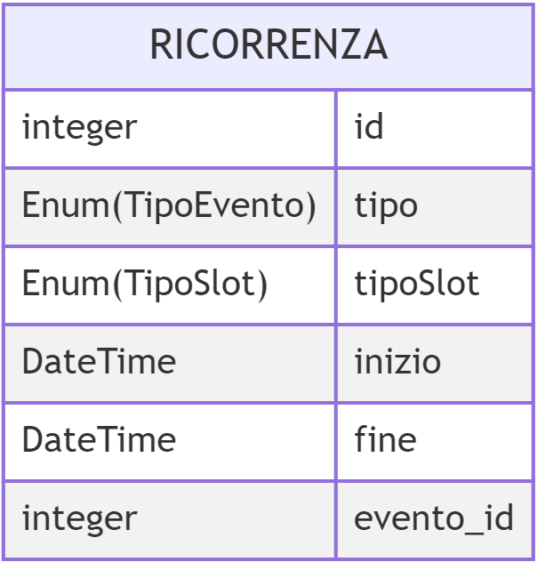
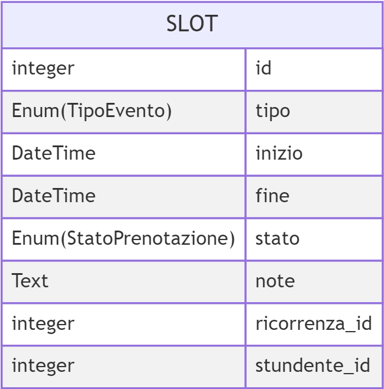
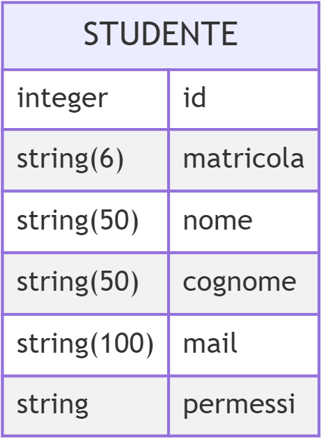

# Database
Di seguito vengono specificate le relazioni e gli attributi delle variè entità usate per realizzare il database. In questo documento a volte verrà citato l'utilizzo di Enum, eccone di segutio i valori e le relative spiegazioni

#### Tipo Evento
Questo Enum è utilizzato per rappresentare i tipi di eventi che possono essere creati. I valori possibili sono:
- *RICEVIMENTO*
- *ESAME*
- *TIROCINIO* 

#### Tipo Slot
Questo Enum è utilizzato per rappresentare i tipi di slot che possono essere creati, che andranno poi ad influenzare l'organizzazione delle prenotazioni. I valori possibili sono:
- *SINGOLO*
- *MULTISLOT* 

#### Stato Prenotazione
Questo Enum è utilizzato per indicare lo stato (a livello di disponibilità) di ogni slot. I valori possibili sono:
- *ATTIVO*: viene usato per indicare gli slot disponibili alla prenotazione
- *PRENOTATO*: viene utilizzato per indicare slot di eventi che sono già stati prenotati, ma che non hanno ancora avuto luogo
- *CONCLUSO*: per indicare slot passati, ovvero che hanno superato la loro data di conlcusione

#### Frequenze
Questo Enum è utilizzato per indicare che tipo di frequenza si vuole applicare all'evento che si sta creando. I valori possibili sono:
- *GIORNALIERA*
- *SETTIMANALE*
- *MENSILE*

## Schema ER
  

## Evento
L'entità Evento viene utilizzata per gestire gli eventi ricorrenti. Di seguito viene mostrato lo schema logico:  
  
  
  
Di ogni evento devono essere specificati il tipo di evento che si vuole creare, il tipo di slot che si vuole utilizzare, data e ora di inzio e fine, il tipo di frequenza da applicare e il termine di questa frequenza, che può essere indicato o tramite un conteggio o tramite una data.

## Ricorrenza
L'entità Riorrenza viene utilizzata per memorizzare tutte le ricorrenze generate da un Evento: queste ricorrenze vengono riempite in automatico dopo la creazione di un evento, utilizzando la regola di ricorrenza specificatata. Tuttavia è comunque possibile creare direttamente una singola ricorrenza, per questo la relazione tra Ricorrenza ed Evento è di tipo *0 a molti*. Di seguito viene mostrato lo schema logico:  
  
  
  
Oltre alla propria chiave primaria e alla chiave esterna di evento, di ogni ricorrenza si conoscono il tipo di evento, il tipo di slot, data e ora di inzio e fine. In nel caso in cui un record di Ricorrenza sia stato generato automaticamente dalla creazione di un evento, allora gli attributi *tipo* e *tipoSlot* serrano ereditati dall'evento generante, mentre data e ora di inzio e fine verranno generati dalla regola di ricorrenza specificata alla creazione dell'evento.

## Slot
L'entità Slot è utilizzata per memorizzare gli slot disponibili per la prenotazione. Tutti i record di Slot vengono generati automaticamente a partire da una Ricorrenza: la durata di ogni ricorrenza viene divisa in slot di durata prestabilita (30 minuti). Tra Ricorrenza e Slot vi è una relazione *1 a molti*, mentre tra Studente e Slot vi è una relazione *0 a molti*: questo perchè uno studente può avere prenotato da zero a molti slot. Di seguito viene mostrato lo schema logico:  
  
  
  
Oltre alla propria chiave primaria e alla chiave esterna di ricorrenza e studente, di ogni slot si memorizzano il tipo di evento (ereditandolo dalla ricorrenza di cui fa parte), data e ora di inzio e fine, lo stato della prenotazione e un campo *note* per consentire al docente di aggiungere delle note relative a quell'appuntamento

## Studente
L'entità Studente è utilizzata per registrare le informazioni di base dello studente, tra cui matricola, nome, cognome, indirizzo mail e i suoi permessi.  
Per quanto riguarda i permessi, essi vengono rappresentati come una stringa unica, separando ogni permesso con una virgola. Ogni permesso è rappresentato da un codice di tre lettere: RIC, ESM e TIR (rispettivamente per Ricevimento, Esame e Tirocinio). Di default, ogni studente ha come permesso RIC, l'aggiunta di altri permessi spetta al docente. Di seguito viene mostrato lo schema logico:  
  

